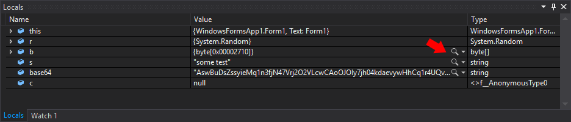
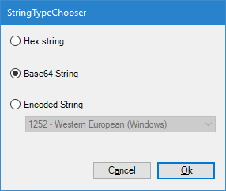
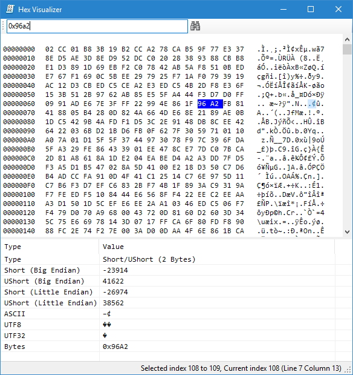

# HexVisualizer

[Mladen Mihajlovic Hex Visualizer](https://bitbucket.org/mmihajlovic/hex-visualizer/src/master/) fork

HexVisualizer provides a viewer for byte arrays so as to display them in a mini hex window. Very useful for debugging network packets and binary files.

Supports VS 2022 Community or Pro edition. Older [VS 2019](https://marketplace.visualstudio.com/items?itemName=Mika76.HexVisualizer2019&ssr=false#overview), [VS 2017 extension](https://marketplace.visualstudio.com/items?itemName=Mika76.HexVisualizer2017) extensions

Additional features:
- Visualizing string variables
- String and byte search
- Copy value to clipboard (right click on value in bottom panel)

## Install

- Visual studio marketplace [installation link](https://marketplace.visualstudio.com/items?itemName=Michael-Krmeine.HexVisualizer-2022)
- Signed VSIX from repo releases

## Use

on VS 2022 it's pretty straight forward. Just explore a byte array



If you select a string a dialog will pop up...



On choice or if just a byte array...



## Setup your own build

May be useful for maintaining new Visual Studio IDE releases

Newer VS IDE releases and product types support is achieved by updating [VSIX manifest](./VsixHexVisualizer/source.extension.vsixmanifest) and building extension on new IDE

### Updating VSIX manifest

1. Update IDE install targets and its' version range
2. Update *Visual Studio MPF* dependency version range
3. Update IDE version ranges for prerequisites: .NET Framework & Visual Studio core editor
4. Build and pack VSIX project release
5. Generate pfx, if doesn't exist, for signing
6. Sign VSIX package
```
vsixsigntool.exe sign /f <certfile> /p <password> /fd sha256 /v <VSIXfile>
```
7. VSIX ready for install on Visual Studio. Profit

## Credit

Uses the Be.Hex control from [Be.HexEditor (.NET C# hex edit control)](http://sourceforge.net/projects/hexbox/)